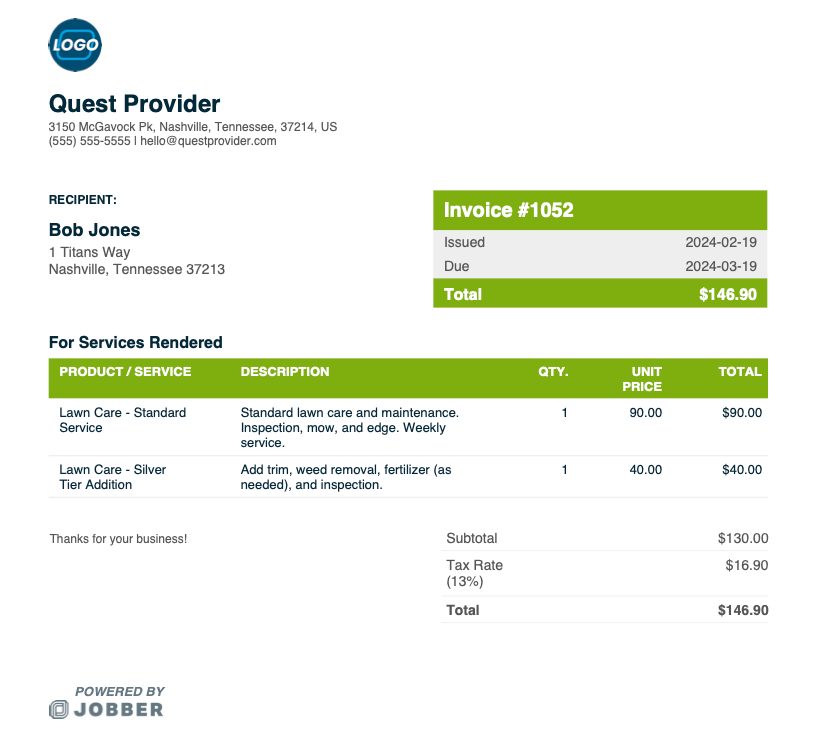

# Invoice Parser

An intelligent invoice data extraction system that uses advanced AI to automatically parse and extract structured data from invoice documents.

## Features

- **AI-Powered Extraction**: Intelligent multimodal invoice parsing
- **Smart Caching**: Instant cached results for same files
- **Compliance Ready**: Built for Indian invoicing standards
- **Easy Export**: Download as JSON or CSV
- **High Accuracy**: Maintains consistency and accuracy in data extraction

## Project Structure

```
project-root/
├── backend/
│   ├── package.json
│   ├── server.js
│   ├── controllers/
│   ├── middleware/
│   ├── routes/
│   ├── services/
│   └── utils/
├── frontend/
│   ├── package.json
│   ├── vite.config.js
│   ├── src/
│   │   ├── components/
│   │   ├── pages/
│   │   ├── hooks/
│   │   └── lib/
│   └── index.html
└── README.md
```

## Getting Started

### Prerequisites
- Node.js (v16 or higher)
- npm or yarn

### Installation

1. **Backend Setup**
```bash
cd backend
npm install
```

2. **Frontend Setup**
```bash
cd frontend
npm install
```

### Environment Variables

Create a `.env` file in the project root:

```env
# Backend Configuration
BACKEND_PORT=5000
GEMINI_API_KEY=your_gemini_api_key_here
NODE_ENV=development

# Frontend Configuration
VITE_API_URL=http://localhost:5000/api
```

### Running the Application

1. **Start Backend**
```bash
cd backend
npm start
```
Backend runs on `http://localhost:5000`

2. **Start Frontend**
```bash
cd frontend
npm run dev
```
Frontend runs on `http://localhost:5173`

## API Endpoints

### Analyze Invoice
- **POST** `/api/invoices/analyze`
- Accepts multipart form data with `invoice` file
- Returns structured invoice data as JSON

### Health Check
- **GET** `/api/health`
- Returns API status

## Extraction Output Format

```json
{
  "invoice_number": "string",
  "date": "YYYY-MM-DD",
  "due_date": "YYYY-MM-DD",
  "vendor_name": "string",
  "vendor_address": "string",
  "client_name": "string",
  "client_address": "string",
  "gst_number": "string",
  "pan_number": "string",
  "subtotal": "string",
  "tax_amount": "string",
  "discount": "string",
  "total_amount": "string",
  "currency": "string",
  "payment_terms": "string",
  "items": [
    {
      "name": "string",
      "description": "string",
      "quantity": "string",
      "unit_price": "string",
      "tax_rate": "string",
      "price": "string"
    }
  ]
}
```

## Supported File Formats

- JPG/JPEG
- PNG
- WEBP
- PDF

## File Size Limit

- Maximum file size: 20MB

## Example Extraction

### Sample Invoice Input


*Quest Provider Invoice - showing vendor details, line items with descriptions, quantities, unit prices, tax rates, and totals.*

### Sample JSON Output
```json
{
  "invoice_number": "1052",
  "date": "2024-02-19",
  "due_date": "2024-03-19",
  "vendor_name": "Quest Provider",
  "vendor_address": "3150 McGavock Pk, Nashville, Tennessee, 37214, US",
  "client_name": "Bob Jones",
  "client_address": "1 Titans Way, Nashville, Tennessee 37213",
  "gst_number": null,
  "pan_number": null,
  "subtotal": "$130.00",
  "tax_amount": "$16.90",
  "discount": null,
  "total_amount": "$146.90",
  "currency": "$",
  "payment_terms": null,
  "items": [
    {
      "name": "Lawn Care - Standard Service",
      "description": "Standard lawn care and maintenance. Inspection, mow, and edge. Weekly service.",
      "quantity": "1",
      "unit_price": "90.00",
      "tax_rate": "13%",
      "price": "$90.00"
    },
    {
      "name": "Lawn Care - Silver Tier Addition",
      "description": "Add trim, weed removal, fertilizer (as needed), and inspection.",
      "quantity": "1",
      "unit_price": "40.00",
      "tax_rate": "13%",
      "price": "$40.00"
    }
  ]
}
```

**Key Features Demonstrated:**
- ✅ Accurate invoice number and date extraction
- ✅ Complete vendor and client information
- ✅ Tax rate extraction from line items (13%)
- ✅ Detailed line item descriptions
- ✅ Proper currency symbol handling
- ✅ Accurate calculation verification:
  - Subtotal: $130.00 (90 + 40)
  - Tax: $16.90 (130 × 13%)
  - Total: $146.90

## Tips for Best Results

- Use high-resolution images (≥ 300 DPI)
- Ensure the invoice is properly upright
- PDFs with text layers work best
- Avoid blurry or heavily cropped images
- Process faster while maintaining consistency and accuracy

## Technologies Used

### Backend
- Node.js & Express
- Google Generative AI (Gemini)
- Multer (file upload handling)
- CORS

### Frontend
- React 18
- Vite
- Tailwind CSS
- Axios
- React Query
- Lucide Icons

## License

MIT License
